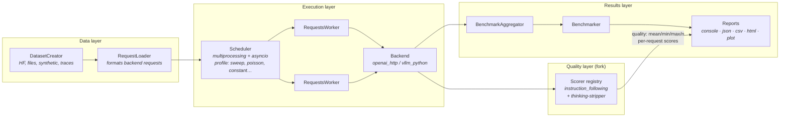

*Fork: [toxicwind/guidellm](https://github.com/toxicwind/guidellm) · Upstream: [vllm-project/guidellm](https://github.com/vllm-project/guidellm)*

<div align="right">

[](LICENSE)
[](https://pypi.org/project/guidellm/)
[](https://pypi.org/project/guidellm/)
[](https://github.com/toxicwind/guidellm/actions/workflows/nightly.yml)
[](https://vllm-project.github.io/guidellm)

</div>

<p align="center">
  <picture>
    <source media="(prefers-color-scheme: dark)" srcset="docs/assets/guidellm-logo-light.png">
    
  </picture>
</p>

<h3 align="center">SLO-aware benchmarking and evaluation platform for optimizing real-world LLM inference — plus pluggable deterministic response scoring</h3>

## Hero

**What.** GuideLLM simulates end-to-end interactions with OpenAI-compatible and vLLM-native servers, generates workload patterns that reflect production usage, and produces detailed reports that help teams understand system behavior, resource needs, and operational limits.

**Why.** Most benchmark tools measure endpoints, not models — they miss TTFT, ITL, output distributions, and dataset-driven variation. GuideLLM captures complete latency and token-level statistics for **SLO-driven evaluation**, generates realistic configurable traffic patterns, and emits standardized reports for dashboards, analysis, and regression tracking. This fork adds the piece upstream never measures: **response content quality**, scored deterministically per-request alongside every performance metric.

**Who.** ML engineers and platform teams tuning LLM deployments, planning capacity, and tracking performance regressions across releases — anyone who needs to answer *"will this model serve our traffic within our SLOs, and does it answer well?"* before production does.

## Features

- **Full SLO-ready metrics** — complete latency distributions: TTFT, inter-token latency (ITL), end-to-end, and token-level statistics
- **Realistic traffic shapes** — `synchronous`, `concurrent`, `throughput`, `constant`, `poisson`, and `sweep` load profiles, with warmup/cooldown and over-saturation detection
- **Real and synthetic data** — HuggingFace datasets, local files (JSON/CSV/text), trace replay (Mooncake), and synthetic text/image/video generators for controlled experiments
- **Multimodal by design** — text, image, audio, and video modalities; chat completions, text completions, audio transcription/translation, embeddings
- **High-throughput engine** — multiprocessing + multithreading + asyncio scheduler driving parallel request workers at production rates
- **Standardized reports** — console, JSON, CSV, HTML (self-contained visual report), and static plots for dashboards and regression tracking
- **Fork addition: deterministic response scoring** — pluggable `Scorer` protocol, registry, and `InstructionFollowingScorer` with thinking-block stripping; per-request scores persisted, quality aggregates (`mean/min/max/n`) reported next to performance numbers
- **Flexible interfaces** — registry-backed CLI (`guidellm run / export / preprocess / mock-server / env`), Python API, JSON/YAML scenario configs, and `GUIDELLM__*` environment variables
- **Mock server** — `guidellm mock-server` spins up an OpenAI-compatible test target with configurable latency, so you can benchmark the pipeline with no GPU at all

## Benchmark flow



Source of truth for components: [`docs/en/guides/architecture.md`](docs/en/guides/architecture.md) and `src/guidellm/`.

## Quick start

Three commands: install, serve, benchmark.

```bash
pip install guidellm[recommended]
```

```bash
vllm serve "neuralmagic/Meta-Llama-3.1-8B-Instruct-quantized.w4a16"
```

```bash
guidellm run \
  --backend kind=openai_http,target=http://localhost:8000 \
  --profile kind=sweep \
  --constraint kind=max_duration,seconds=30 \
  --data kind=synthetic_text,prompt_tokens=256,output_tokens=128
```

You will see live progress and per-benchmark summaries (see [`docs/assets/sample-benchmarks.gif`](docs/assets/sample-benchmarks.gif)). GuideLLM writes `benchmarks.json` and `benchmarks.csv` to the current directory (or `GUIDELLM__DEFAULT_RESULTS_DIR` when set). Add formats with `--output` — see [output configuration](docs/en/guides/outputs.md#cli-output-configuration).

### No GPU? Test the pipeline anyway

```bash
guidellm mock-server --port 8000 &
guidellm run --backend kind=openai_http,target=http://localhost:8000 \
  --profile kind=concurrent,streams=8 \
  --constraint kind=max_requests,count=100 \
  --data kind=synthetic_text,prompt_tokens=64,output_tokens=32
```
Specifying `--output` replaces the default JSON and CSV outputs. See [output configuration](docs/en/guides/outputs.md#cli-output-configuration) for examples of selecting formats, including generating HTML alongside JSON and CSV.

## Output Files and Reports

Use JSON or YAML for detailed analysis, CSV for spreadsheet comparisons, HTML for self-contained visual reports, and PLOT for static performance graphs. See [supported file formats](docs/en/guides/outputs.md#supported-file-formats) for their contents and default filenames, and [configuring file outputs](docs/en/guides/outputs.md#configuring-file-outputs) to choose output paths.

The console provides a summary of each benchmark. Its tables can be copied into spreadsheet software using `|` as the delimiter. See [console output](docs/en/guides/outputs.md#console-output) for progress and display controls.


## Common Use Cases and Configurations

GuideLLM supports a wide range of LLM benchmarking workflows. The examples below show how to run typical scenarios and highlight the parameters that matter most. For a complete list of arguments, details, and options, run `guidellm run --help`.

Each registry-backed option uses the form `--<option> kind=<TYPE>,<CONFIG>...`, where `CONFIG` is key=value pairs. For more complex configurations, use JSON or YAML, e.g. `--data '{"kind":"huggingface","source":"abisee/cnn_dailymail","load_kwargs":{"name":"3.0.0"}}'`.

### Load Patterns

Simulating different applications requires different traffic shapes. This example demonstrates rate-based load testing using a constant profile at 10 requests per second, running for 20 seconds with synthetic data of 128 prompt tokens and 256 output tokens.

```bash
guidellm run \
  --backend kind=openai_http,target=http://localhost:8000 \
  --profile kind=constant,rate=10 \
  --constraint kind=max_duration,seconds=20 \
  --data kind=synthetic_text,prompt_tokens=128,output_tokens=256
```

**Real dataset** — HuggingFace CNN/DailyMail with column mapping:

```bash
guidellm run \
  --backend kind=openai_http,target=http://localhost:8000 \
  --data kind=huggingface,source=abisee/cnn_dailymail,load_kwargs.name=3.0.0 \
  --data-column-mapper kind=generative_column_mapper,column_mappings.text_column=article
```

**Key parameters:**

- `--data`: Data type plus config — `synthetic_text`, `huggingface`, `json_file`, `csv_file`, `text_file`, `trace_synthetic`, and others. Repeat for multiple sources.
- `--data-column-mapper`: Column mapping preprocessor and JSON config for fields such as `text_column` or `output_tokens_count_column`
- `--data-loader type=pytorch,samples=1000`: Limit how many rows are loaded (`-1` for all)
- `--tokenizer huggingface_auto "model=gpt2"`: Tokenizer for synthetic data or local token counting

### Synthetic Visual Data

GuideLLM can synthesize images and short videos on the fly so you can benchmark Vision-Language Model (VLM) serving configurations without bringing your own dataset. Two `--data` kinds — `synthetic_image` and `synthetic_video` — compose with `synthetic_text` for multimodal prompts. See [Synthetic Visual Data](docs/en/guides/multimodal/synthetic_vision.md) for example commands and the full list of configuration options.

### Request Types and API Targets

You can benchmark chat completions, text completions, or other supported request types. This example configures the benchmark to test the chat completions API using a custom dataset file, with GuideLLM automatically formatting requests to match the chat completions schema.

```bash
guidellm run \
  --backend kind=openai_http,target=http://localhost:8000,request_format=/v1/chat/completions \
  --data kind=json_file,path=path/to/data.json
```

**Key parameters:**

- `--backend`: Backend type and connection settings, including the `target` OpenAI-compatible endpoint URL and `request_format` for the API endpoint (`/v1/chat/completions`, `/v1/completions`, `/v1/embeddings`, `/v1/audio/transcriptions`, and others)

### Using Scenarios

Built-in scenarios bundle schedules, dataset settings, and request formatting to standardize common testing patterns. This example uses the pre-configured chat scenario which includes appropriate defaults for chat model evaluation, with any additional CLI arguments overriding the scenario's settings.

```bash
guidellm run \
  --config chat \
  --backend kind=openai_http,target=http://localhost:8000
```

**Reproducible sweeps** — concurrent benchmark with warmup/cooldown and error budget:

```bash
guidellm run \
  --backend kind=openai_http,target=http://localhost:8000 \
  --profile kind=concurrent,streams=16,warmup=0.1,cooldown=0.1 \
  --constraint kind=max_errors,count=5 \
  --constraint kind=over_saturation \
  --data kind=synthetic_text,prompt_tokens=256,output_tokens=128
```

**Synthetic vision-language** — generate images/video on the fly, no dataset needed:

```bash
guidellm run \
  --backend kind=openai_http,target=http://localhost:8000 \
  --data kind=synthetic_image --data kind=synthetic_text,prompt_tokens=64,output_tokens=32
```

See [Synthetic Visual Data](docs/en/guides/multimodal/synthetic_vision.md) for the full option list.

**Key knobs** (full reference: `guidellm run --help`)

| Flag | Meaning |
| --- | --- |
| `--backend kind=<TYPE>,<CONFIG>…` | Backend type + config, e.g. `openai_http,target=…`, `request_format=/v1/chat/completions` |
| `--profile kind=<type>,…` | Traffic pattern: `synchronous`, `concurrent`, `throughput`, `constant`, `poisson`, `sweep` |
| `--constraint kind=<type>,…` | `max_duration`, `max_requests`, `max_errors`, `over_saturation` |
| `--data kind=<type>,…` | `synthetic_text`, `synthetic_image`, `synthetic_video`, `huggingface`, `json_file`, `csv_file`, `text_file`, `trace_synthetic`… |
| `--data-column-mapper` | Column-mapping preprocessor, e.g. `kind=generative_column_mapper,column_mappings.text_column=article` |
| `--tokenizer` | Tokenizer for synthetic data / local counting, e.g. `huggingface_auto "model=gpt2"` |
| `--config` (`-c`, `--scenario`) | Built-in scenario name or path to a custom scenario file |
| `--output` | Replace default JSON+CSV outputs (add HTML, plots, …) |

## Fork addition: response-quality scoring

GuideLLM natively measures latency, throughput, and token distributions — it never inspects response *content*. This fork adds **pluggable deterministic response scoring**: every completed request is scored, per-request scores are persisted, and quality aggregates are reported alongside the performance numbers.

### Scorers

| Module | Role |
| --- | --- |
| `guidellm.benchmark.scoring.protocol` | `Scorer` protocol: `name`, `score(output, expected=None, context=None) -> ScorerResult(score, details)` |
| `guidellm.benchmark.scoring.registry` | `register_scorer` / `get_scorer` — scorers referenced by name in scenario config |
| `guidellm.benchmark.scoring.instruction` | `InstructionFollowingScorer` — deterministic sentinel scoring: exact normalized match = `2.0`, sentinel present with extra text = `1.0`, missing/empty/error = `0.0` |
| `guidellm.benchmark.scoring.adapters` | `ThinkingBlockStripper` — strips `<think>`, `<thinking>`, `<reasoning>`, `<thought>`, `<scratchpad>`, and fenced thinking blocks (true nesting, innermost-first) before delegating; reports under `<scorer>_nothink` with `stripped: bool` |

### Wiring it in a scenario

```yaml
metrics:
  kind: generative
  scorers: ["instruction_following"]
  scorer_config:
    instruction_following:
      sentinel: "ABSTRACT-7X3Q"
      strip_thinking: true
```

### Semantics and report fields

- Every terminal request is scored into its per-request record: `RequestStats.scores` and `RequestStats.score_details`. Empty output on a completed request scores `0.0` (model silence is data). A scorer exception records `0.0` plus `error: "TypeName: message"` in details — it never aborts the run.
- **Quality aggregates cover completed requests only.** Transport/provider-errored requests are scored for the record but excluded from `quality_totals` — provider failures are reliability signal, not instruction-following signal.
- Reports gain `quality: {<scorer>: {mean, min, max, n}}` and `quality_instrument: {scorer, semantics, thinking_strip, tokenizers, …}` identifying the instrument, scope, and formality tier.
- With no scorers configured, reports serialize exactly as upstream: scoring-only fields are omitted from the JSON (not serialized empty), regression-tested against the pre-scoring schema.

## Architecture

Grounded in `src/guidellm/` — the component chain mirrors [`docs/en/guides/architecture.md`](docs/en/guides/architecture.md):

| Directory | Role |
| --- | --- |
| `benchmark/` | `Benchmarker` (aggregates per-benchmark schedulers), `BenchmarkAggregator`, profiles, scenarios, output writers (`outputs/` incl. self-contained HTML report), and the fork's `scoring/` module |
| `scheduler/` | Multiprocessing/asyncio request scheduler — strategies, worker pool, constraints, DAG of benchmark environments |
| `backends/` | Backend implementations: `openai` (HTTP, incl. websocket audio) and `vllm_python` (in-process vLLM API) |
| `data/` | Dataset loading, synthetic generators (text/image/video/audio), tokenizers, multimodal preprocessors |
| `schemas/` | Pydantic configs for benchmark specs, scenarios (`*.json` scenario files), and requests |
| `cli/` | Click CLI: `run`, `export`, `preprocess`, `mock-server`, `env` |
| `mock_server/` | OpenAI-compatible mock server for pipeline testing |
| `settings.py` | `GUIDELLM__*` env-var configuration (e.g. `GUIDELLM__SPEC__BACKEND`, `GUIDELLM__DEFAULT_RESULTS_DIR`) |

**Backend support:** OpenAI-compatible HTTP servers (any vendor, incl. vLLM) via `openai_http`, and in-process vLLM via `vllm_python`. Endpoints covered: `/completions`, `/chat/completions`, `/embeddings`, `/audio/transcriptions`, `/audio/translations`. **Outputs:** console, JSON, CSV, HTML, plots. **Container:** multi-arch images at `ghcr.io/vllm-project/guidellm` (`linux/amd64` + `linux/arm64`):

| Tag | Meaning |
| --- | --- |
| `vX.Y.Z` | Immutable release (multi-arch from `v0.7.0+`) |
| `stable` | Newest full release |
| `latest` | Newest release tag (may include pre-releases) |
| `nightly` | Tip of `main` |

## Comparison

| Tool | CLI | API | High Perf | Full Metrics | Data Modalities | Profiles | Backends | Output Types |
| --- | --- | --- | --- | --- | --- | --- | --- | --- |
| **GuideLLM** | ✅ | ✅ | ✅ | ❌ | Text, Image, Audio, Video | Synchronous, Concurrent, Throughput, Constant, Poisson, Sweep | OpenAI-compatible | console, json, csv, html |
| [inference-perf](https://github.com/kubernetes-sigs/inference-perf) | ✅ | ❌ | ✅ | ❌ | Text | Concurrent, Constant, Poisson, Sweep | OpenAI-compatible | json, png |
| [genai-bench](https://github.com/sgl-project/genai-bench) | ✅ | ❌ | ❌ | ❌ | Text, Image, Embedding, ReRank | Concurrent | OpenAI-compatible, Hosted Cloud | console, xlsx, png |
| [llm-perf](https://github.com/ray-project/llmperf) | ❌ | ❌ | ✅ | ❌ | Text | Concurrent | OpenAI-compatible, Hosted Cloud | json |
| [vllm/benchmarks](https://github.com/vllm-project/vllm/tree/main/benchmarks) | ✅ | ❌ | ❌ | ❌ | Text | Synchronous, Throughput, Constant, Sweep | OpenAI-compatible, vLLM API | console, png |

GuideLLM is the only one in the table with both a Python API and full latency distributions (TTFT/ITL), and this fork adds response-quality scoring that none of them measure.

## Configuration

Three ways to configure a run, increasing in power:

1. **CLI flags** — registry-backed form `--<option> kind=<TYPE>,<CONFIG>…`, where `CONFIG` is `key=value` pairs; complex values take JSON/YAML, e.g. `--data '{"kind":"huggingface","source":"abisee/cnn_dailymail","load_kwargs":{"name":"3.0.0"}}'`
2. **Scenario files** — `--config` / `--scenario` / `-c` takes a built-in scenario name or a path to a custom YAML/JSON scenario bundling schedules, datasets, and request formatting ([`src/guidellm/schemas/benchmark/scenarios/`](src/guidellm/schemas/benchmark/scenarios/) ships the built-ins)
3. **Environment variables** — `GUIDELLM__SPEC__BACKEND`, `GUIDELLM__SPEC__PROFILE`, `GUIDELLM__SPEC__CONSTRAINTS`, `GUIDELLM__SPEC__DATA`, `GUIDELLM__DEFAULT_RESULTS_DIR` (see the container example in Quick Start)

Scoring config lives under `metrics:` in the scenario (`scorers`, `scorer_config` — see [Wiring it in a scenario](#wiring-it-in-a-scenario)).

## Development

Prerequisites: Python 3.10+, [uv](https://docs.astral.sh/uv/getting-started/installation/) (recommended), Git, Tox.

```bash
git clone https://github.com/toxicwind/guidellm.git
cd guidellm
uv sync --frozen
```

Or with pip:

```bash
python -m venv .venv && . .venv/bin/activate
pip install --group dev -e .
```

Quality gates (from [CONTRIBUTING.md](CONTRIBUTING.md)):

```bash
tox -e lint-check    # Black + Ruff
tox -e lint-fix      # auto-fix style issues
tox -e type-check    # Mypy
tox                  # full test suite
```

Standards: Black formatting, Ruff linting, Mypy type checking, pytest unit tests for every new feature or bug fix, docs updated alongside code changes. Open a PR against the fork with a clear description and linked issues; the [CODE_OF_CONDUCT.md](CODE_OF_CONDUCT.md) applies to all project spaces. Full environment guide: [DEVELOPING.md](DEVELOPING.md).

## What's new (upstream)

**Recent additions:** new CLI with improved configuration/validation; in-process vLLM Python backend and websocket audio-transcription backend; multi-turn conversation benchmarking; full tool calling (client + server side) in chat completions and responses APIs; synthetic video/image datasets; Mooncake trace replay; geospatial LLM support.

**Active development:** OTEL/WEKA trace replay; standard-workflow scenario improvements; stackable scenario files; per-benchmark constraint overrides; gRPC backend for vLLM-native servers.

## Docs
Full reference at [vllm-project.github.io/guidellm](https://vllm-project.github.io/guidellm) and in [`docs/en/`](docs/en/):

- [**Installation Guide**](https://github.com/vllm-project/guidellm/blob/main/docs/en/getting-started/install.md) - This guide provides step-by-step instructions for installing GuideLLM, including prerequisites and setup tips.
- [**Backends Guide**](https://github.com/vllm-project/guidellm/blob/main/docs/en/guides/backends.md) - A comprehensive overview of supported backends and how to set them up for use with GuideLLM.
- [**Data/Datasets Guide**](https://github.com/vllm-project/guidellm/blob/main/docs/en/guides/datasets.md) - Information on supported datasets, including how to use them for benchmarking.
- [**Metrics Guide**](https://github.com/vllm-project/guidellm/blob/main/docs/en/guides/metrics.md) - Detailed explanations of the metrics used in GuideLLM, including definitions and how to interpret them.
- [**Outputs Guide**](https://github.com/vllm-project/guidellm/blob/main/docs/en/guides/outputs.md) - Information on the different output formats supported by GuideLLM and how to use them.
- [**Architecture Overview**](https://github.com/vllm-project/guidellm/blob/main/docs/en/guides/architecture.md) - A detailed look at GuideLLM's design, components, and how they interact.

## License

GuideLLM is licensed under the [Apache License 2.0](LICENSE) — © Red Hat. Contributions are licensed under the same terms ([CONTRIBUTING.md](CONTRIBUTING.md#license)).

**Security:** this repo ships no `SECURITY.md` and no documented security contact. Report suspected vulnerabilities via [GitHub Issues](https://github.com/toxicwind/guidellm/issues) (upstream: [vllm-project/guidellm/issues](https://github.com/vllm-project/guidellm/issues)).

## Cite

```bibtex
@misc{guidellm2024,
  title={GuideLLM: Scalable Inference and Optimization for Large Language Models},
  author={Neural Magic, Inc.},
  year={2024},
  howpublished={\url{https://github.com/vllm-project/guidellm}},
}
```
